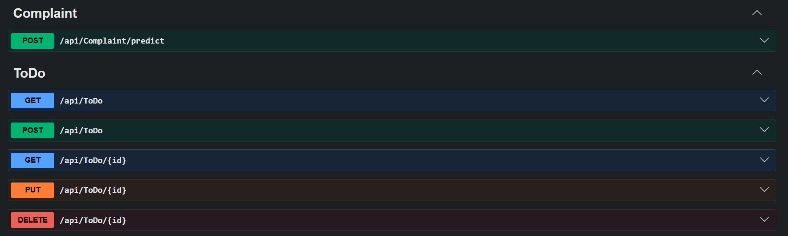

# Sample API with EF Core and ML.NET

A learning project built with ASP.NET Core Web API, Entity Framework Core, SQL Server, and ML.NET.

The project contains a Todo CRUD API and a machine learning model that classifies municipality complaint texts into categories.

## 🚀 Features

- Todo CRUD operations
- Controller and Service Layer architecture
- Dependency Injection
- Entity Framework Core
- SQL Server LocalDB
- EF Core migrations
- Asynchronous database operations
- ML.NET multiclass text classification
- Model training from CSV data
- Model persistence as a `.zip` file
- Complaint category prediction endpoint
- Swagger API documentation

## 🏗️ Architecture

```text
HTTP Request
      ↓
Controller
      ↓
Service
      ↓
EF Core / ML.NET
      ↓
SQL Server / Trained Model
```

## 🤖 Machine Learning Flow

```text
Labeled CSV Data
        ↓
FeaturizeText
        ↓
Feature Vector
        ↓
SDCA Maximum Entropy Trainer
        ↓
Trained Model
        ↓
complaint-model.zip
```

## 🔮 Prediction Flow

```text
Complaint Text
      ↓
ComplaintModelService
      ↓
Trained ML.NET Model
      ↓
Predicted Category
```

## 📸 API Overview


